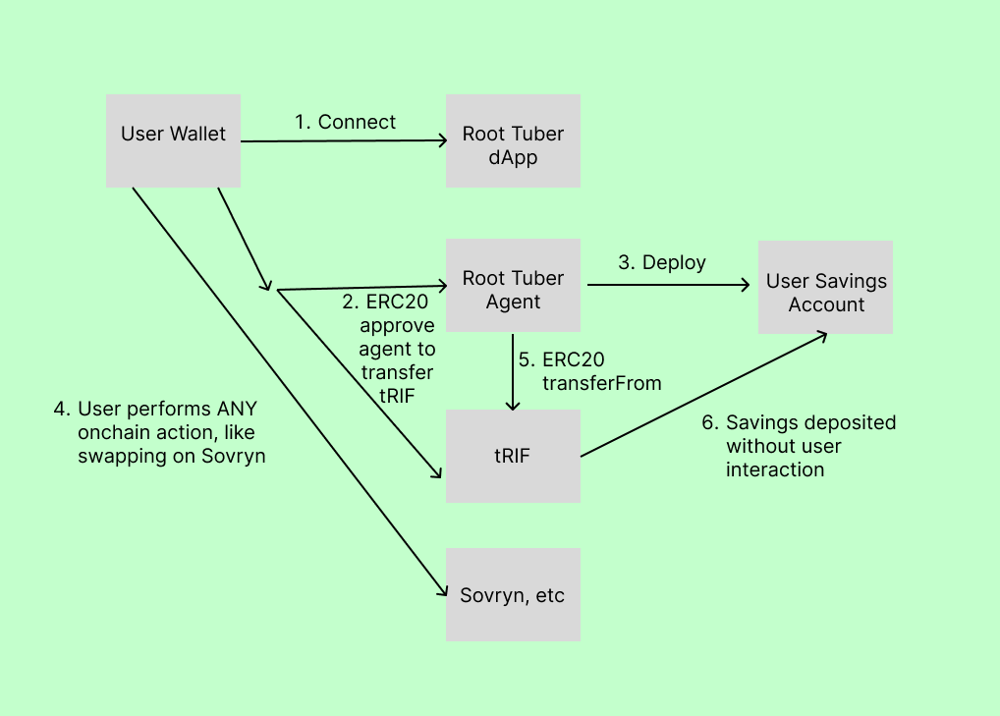

# Root Tuber

- [Demo](https://root-tuber.vercel.app)
- [Canva](https://www.canva.com/design/DAGGyhXc-mI/x4ZHojDlje4Ey5AQEh2Q6g/edit)

## Project details

### Short description

Root Tubers are how plants save energy.
Like Acorns.com (but crypto), Root Tuber lets users save a little bit of money every time they spend onchain.

### Full description

Root Tuber is built by the [Locker](https://locker.money) team.
At Locker, we are using 4337 AA with session keys to automate smart accounts with limited permissions.
But we want to be able to support chains like Rootstock where session keys are not yet supported.

Instead of [session keys](https://docs.zerodev.app/blog/session-keys-are-the-jwts-of-web3),
Root Tuber uses ERC20 allowances to move funds on the user's behalf.
Savings are kept in a personal smart account we wrote that locks up funds for a user specified amount of time.

### Technical details

Building on Rootstock was easy because of it's innate EVM compatibility.
Rootstock also has better tooling options than many other EVMs.
Root Tuber uses the following tooling:

- tRIF: Savings token
- Covalent: Fetching account information
- Third Web: General RPC
- Blockscout: Explorer
- Tenderly: Debugging
- Wagmi/Viem: Web3 interactions
- NextJS + React: Framework
- Vercel: Hosting
- Supabase: DB
- Foundry: Smart contract development
- RainbowKit: Wallet connection

We had planned to use Etherspot AA but solutions but they are not available on testnet.

From a product perspective, enabling EVM users to save BTC is a huge win.
Many casual crypto users lack the discipline to save BTC regularly.
Because of Rootstock's unique BTC on EVM, Root Tuber is able to automate savings and hopefully provide generational wealth for users.



### API

#### /api/automations/create

Tells backend to watch the blockchain for transactions that should trigger user savings.

```
curl -X POST http://localhost:3000/api/automations/create -H "Content-Type: application/json" -d '{"ownerAddress":"0xAF115955b028c145cE3A7367B25A274723C5104B","erc20Address":"0x19f64674D8a5b4e652319F5e239EFd3bc969a1FE","savingPercent":10,"chainId":31}'
```

### /api/automations/execute

Force the backend to trigger savings.

```
curl -X POST http://localhost:3000/api/automations/execute
```

### Example deployment details

Every user brings their own wallet and gets a personal savings account.
There is a single agent for the whole application.
Here are sample accounts where you can see savings activity.

- User wallet: [0xAf115955B028c145Ce3A7367B25A274723c5104b](https://rootstock-testnet.blockscout.com/address/0xAf115955B028c145Ce3A7367B25A274723c5104b?tab=txs)
- Savings account: [0x2EE730a66ff7143794be6c23f44eD4c03F5296c3](https://rootstock-testnet.blockscout.com/address/0x2eE730a66fF7143794bE6C23F44ED4c03f5296C3)
- Agent account: [0xF46A02660f466dA0bfD558A02a53fd891FB33a44](https://rootstock-testnet.blockscout.com/address/0xF46A02660f466dA0bfD558A02a53fd891FB33a44?tab=txs)
